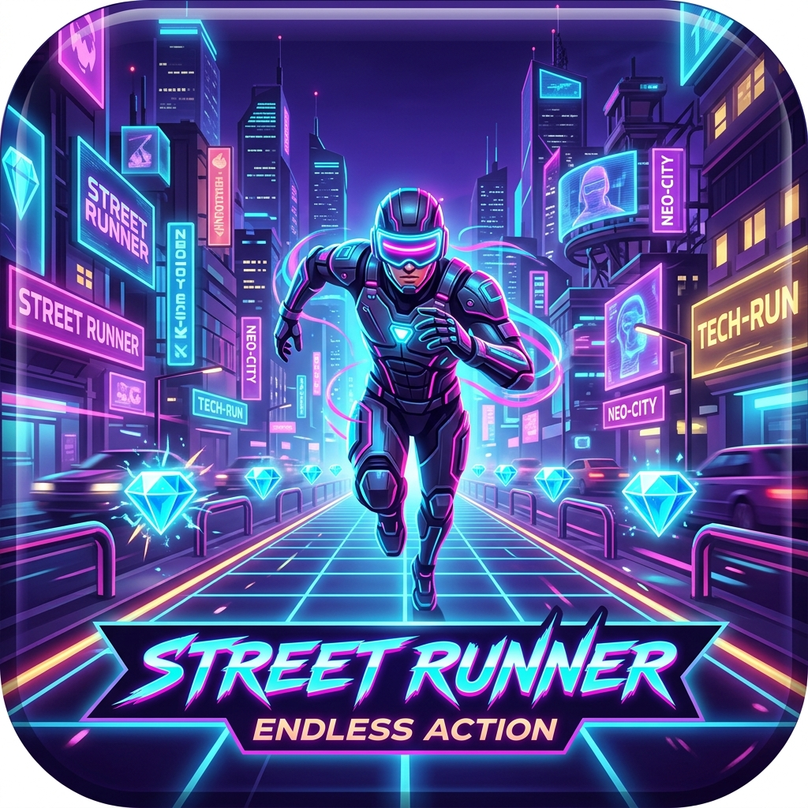

# ⚡ STREET RUNNER: CYBER HIGHWAY



An adrenaline-fueled, high-octane 2.5D Cyberpunk Endless Street Runner mobile game built with vanilla HTML5, Canvas, and pure procedural Web Audio API.

## 🚀 Features

- **2.5D Synthwave Highway Engine**: Perspective roadway with moving gridlines, retro sunset, city skyline, and camera shake.
- **Dynamic Obstacles**:
  - **Low Laser Grids**: Vault over with a timely Jump!
  - **High Plasma Beams**: Slip underneath with a low-profile Slide!
  - **Cyber Barricades**: Swiftly shift lanes to evade!
- **Power-Up System**:
  - 🧲 **Quantum Magnet**: Automatically draws all nearby diamonds.
  - 🛡️ **Nexus Shield**: Absorbs a collision safely.
  - ⚡ **Overdrive**: Blazing hyper-speed invulnerability that smashes obstacles.
  - ✖️2 **Matrix Multiplier**: 2x score boost.
- **Procedural Synth SFX & Music Engine**: Real-time Web Audio API synthesizer — instant loading, zero latency, zero audio file download errors.
- **Cyber Garage & Shop**: Unlock 5 distinct runner skins (*Cyber Cyan, Neon Valkyrie, Hyperion Gold, Viper Matrix, Quantum Shadow*) and upgrade power-up durations using collected diamonds!
- **Mobile First Touch Controls**: Touch swipes (←, →, ↑, ↓) + optional on-screen tactile buttons.
- **Offline Save System**: High scores, diamond balances, and upgrade levels automatically persist in `localStorage`.

## 🎮 How to Play

### Mobile Controls:
- **Swipe Left / Right**: Switch Lanes
- **Swipe Up**: Jump over Low Laser Barriers
- **Swipe Down**: Slide under Overhead Gates
- **Tap Pause Icon**: Pause / Resume

### Desktop / Keyboard Controls:
- **Arrow Keys** or **A / D**: Switch Lanes
- **Space** or **W / Up Arrow**: Jump
- **S** or **Down Arrow**: Slide
- **Esc** or **P**: Pause

## 🛠️ Local Development & Running the Game

### Option 1: Run with Standard Python (No Flask required!)
```bash
python server.py
# or
python main.py
```
This automatically boots a local HTTP server at [http://127.0.0.1:8000](http://127.0.0.1:8000) using Python's standard library and automatically opens your browser.

### Option 2: Run with Node.js
```bash
npm start
# or
node server.js
```
Open [http://localhost:3050](http://localhost:3050) in your browser.

## ⚡ Speed & Difficulty Progression
- **START_SPEED**: `4.0`
- **MAX_SPEED**: `14.0`
- **ACCELERATION**: `0.08` per second
Speed accelerates dynamically with survival time: `game_speed = min(START_SPEED + elapsed_time * ACCELERATION, MAX_SPEED)`.

